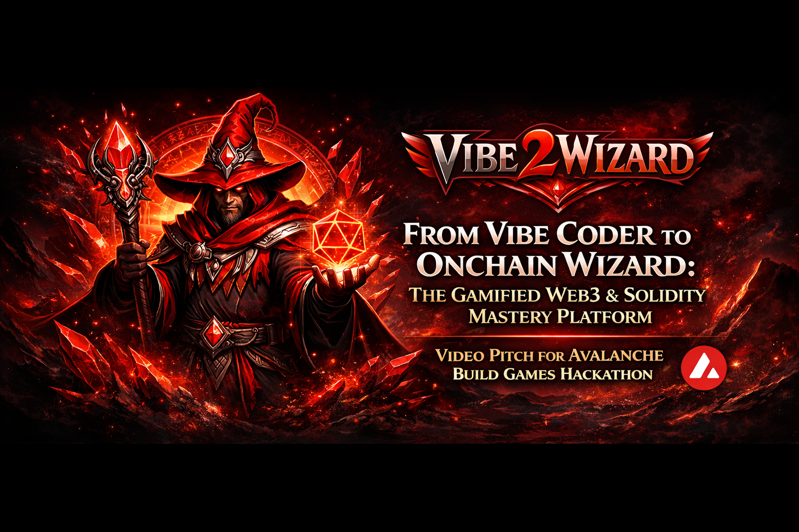

# Vibe2Wizard - From Vibe Coder to Onchain Wizard: The Gamified Web3 & Solidity Mastery Platform - Complete Project Proposal

## Executive Summary

Vibe2Wizard is a gamified learning platform that turns anyone — from curious designers to seasoned engineers — into verifiable onchain developers. We solve three interconnected problems: the lack of safe, risk-free environments to learn Solidity; the impossibility of proving your skills without putting real money on the line; and protocols' inability to distinguish genuine users from airdrop hunters.

Our core innovation is the Soulbound Passport — an ERC-1155 soulbound identity that lives forever onchain, owns its own smart wallet, and visually evolves from a hooded initiate to a glowing Archmage as you complete real onchain deployments. Every badge links to an actual transaction. Every skill is verifiable. Every credential travels with you across chains.

We differ from existing platforms because we don't just track completion — we track real onchain actions. Galxe gives you transferable credential tokens. Layer3 offers shallow verification. CryptoZombies leaves you with local progress and nothing to show. We built what we wished existed when we were learning: a platform where your work actually belongs to you, forever, in a form anyone can verify.

The market is ready. Protocols spend billions annually on user acquisition and see little retention. Developers have no portable way to prove their skills. The next wave of Web3 entrants deserves better than guesswork and lost money. Vibe2Wizard is that better path.

---

## Problem Framing

### Problem Statement

Vibe2Wizard solves the fragmented, high-risk, and unverifiable nature of learning Solidity and Web3 by turning every real onchain action into a progressive, gamified quest that mints a permanent soulbound developer passport — giving users from absolute beginners to senior engineers verifiable proof of skill, safe practice environments, and direct sponsor rewards while giving protocols access to genuinely engaged users.

### 1. What is the problem?
Learning Web3 is supposed to be about building the future. Instead, it's become an expensive game of guess-who with your own money. You spend hours debugging a contract that looks right, deploy it, and watch your gas vanish into nothing because of a typo you couldn't see. You try to learn from a course that was written two years ago, back when Solidity looked completely different. You finally deploy to mainnet — cautiously, excitedly — and then you realize you left a vulnerability that a bot found before you did. Your money is gone. Your project is dead. And you have nothing to show for it except a lesson that cost you real money.

That's the vibe-coding trap. You either stay on the surface, copy-pasting tutorials without understanding what's happening underneath, or you dive in and risk losing everything. There's no middle ground. No safe place to practice. No way to prove you know what you're doing without actually putting your money on the line.

And even if you do make it through? There's no proof. You can have a beautiful GitHub repo, but so does everyone else. You can point to a deployed contract, but anyone can deploy code someone else wrote. There's no credential that travels with you, no reputation that sticks, no way to show the world what you've actually accomplished.

### 2. Who is affected?
This hits a wider range of people than you'd expect. If you've ever tried to break into Web3, you already know the struggle — but the specific flavor of pain depends on where you're starting from.

| Profile | Background | Pain Point |
|---------|------------|------------|
| **Vibe Coders** | Designers, founders, marketers who just want to build in Web3 without learning CS | Scared to touch code, don't want to lose money to basic mistakes |
| **Junior/Mid Devs** | Know JavaScript, maybe touched some Solidity | Can't land a job because no one's verifying their skills |
| **Senior Engineers** | Years of Web2 experience, solid EVM knowledge | No way to prove what they know to DAOs or grant committees |
| **Career Switchers** | Coming from finance, marketing, other industries | No technical network, no portfolio, no credibility |
| **Bootcamp Grads** | Just finished a Web3 coding bootcamp | Every other applicant has the same copy-pasted GitHub repos |
| **Designers & Creators** | Want to launch NFTs, tokens, or onchain art | Can't afford a developer or don't want to rely on one |
| **Technical Leads / CTOs** | Managing Web3 teams, evaluating talent | Can't verify if candidates actually wrote their code |
| **Protocols & DAOs** | Building products, need real users | Burning budget on airdrop hunters who vanish overnight |
| **Security Researchers** | Auditors, bug bounty hunters | No portable way to show verified audit history |
| **Open Source Contributors** | Maintain Web3 libraries, tools | No way to prove impact or earn recognition that travels with them |

### 3. Why is this problem worth solving?
Because Web3 isn't going anywhere. The next wave of people entering this space deserve better than what we had. They deserve a safe place to learn, a fair way to prove what they've learned, and a path to actually build a career without starting from zero every single time.

Here's what happens if we solve this:
- Developers actually get better. Instead of vibe-coding their way through tutorials, they deploy real contracts and earn real credentials.
- Hiring actually works. DAOs can look at someone's onchain passport and know exactly what they've done. No more guessing.
- Marketing actually delivers. Protocols pay for real engagement, not wallet addresses that vanish overnight.
- Credentials actually matter. Your skills follow you across chains, across jobs, across your entire career.
- Developers stop losing money. Sponsored gas and testnet-first learning means zero financial risk while learning.
- Security improves across the ecosystem. When developers learn properly with real feedback, fewer vulnerable contracts make it to mainnet.
- Protocols get genuine users, not airdrop hunters. Onchain proof of engagement means sponsors reach people who actually care.
- Talent becomes verifiable. Senior engineers can prove their skills to DAOs and grant committees without a LinkedIn profile.
- Career switchers get a fair shot. Your passport speaks for itself — no nepotism, no gatekeeping, just onchain proof.
- Learning becomes addictive. Gamification with evolving NFTs, daily quests, and leaderboards makes mastering Web3 genuinely fun.
- Cross-chain reputation becomes possible. Your credentials travel with you regardless of which network you build on.
- Open source contributors finally get recognized. Maintainers of popular libraries can prove their impact onchain.
- Security researchers build verifiable track records. Auditors can show their onchain audit history without revealing identity.
- Designers can ship without developers. The Vibe Track lets non-coders launch NFTs and tokens without touching Solidity.
- Protocols save millions. Instead of burning budget on fake users, sponsor rewards go to people who actually engage.

Blockchain makes all of this possible. Not because it's cool, but because it's the only technology that creates records that can't be faked, credentials that can't be sold, and rewards that happen automatically without a middleman.

## Market Opportunity

The Web3 developer ecosystem is exploding, but the infrastructure to support its growth is lagging badly.

### The Developer Gap

Solidity developers remain in high demand as more protocols build on EVM-compatible chains, yet the number of competent Web3 developers remains far below what's needed. The developer ecosystem is growing, but at a pace that can't keep up with protocol demand.

### The Education Market

The e-learning market is substantial and growing, with tech education representing a significant segment. Web3-specific training is still emerging, and coding bootcamps have started adding Web3 modules, but they face the same problems we identified: outdated curriculum, no way to verify real skills, and graduates who can't demonstrate competency without deployable code and credentials that travel with them.

### The User Acquisition Problem

Protocols spend heavily on user acquisition through airdrops, incentivized pools, and bounty programs — but the ROI is poor. Most wallet addresses that flow into protocols through these campaigns vanish shortly after. There's no way to distinguish someone who genuinely understands the protocol from someone who just wants the token. This creates an opportunity for any solution that can verify real, engaged users — which is exactly what our Passport provides.

### The Talent Verification Gap

DAOs and protocols need to hire, but they have almost no tools to verify whether a candidate actually knows what they claim. GitHub repos can be copied. Deployed contracts can be tutorials someone followed. There's no portable, verifiable credential system for Web3 developers — the same problem LinkedIn solved for traditional tech, but adapted for onchain reality.

### Why Now

Several trends are converging that make this the right time:

- **ERC standards are mature.** ERC-1155, 6239, 7510, 5646, 5679, 4906, 4361, 2981 give us the building blocks for portable, non-transferable, machine-readable credentials with Token Bound Accounts, dynamic metadata, and state fingerprinting that simply didn't exist two years ago. We implement using only Final-status standards.
- **Cross-chain infrastructure works.** Axelar, LayerZero, and similar protocols make it realistic to build credentials that actually travel across chains, not just exist in one ecosystem.
- **Gamification works.** The success of Galxe, Layer3, and even pump.fun proves that users respond to progress tracking, badges, and visual rewards. We're taking that same psychology and applying it to actual skill-building.
- **Protocols are desperate.** The airdrop model is broken. Marketing budgets are being scrutinized. Any platform that can deliver genuinely engaged users instead of wallet farmers is worth serious money.

### Why Avalanche?

We chose **Avalanche** as our primary chain for strategic reasons that benefit all stakeholders:

- **Sub-second finality** means users see their badges mint instantly — no waiting 12+ minutes like Ethereum mainnet. This is critical for the gamification feel-good moment when you earn a badge.
- **Low fees** (often <$0.01 for simple transactions) make it practical to mint badges on every learning milestone without burning through sponsor budgets. Users can deploy 100 contracts for what would cost $1 on Ethereum.
- **EVM compatibility** means Solidity developers feel at home — no new language to learn, no unfamiliar tooling. The curriculum translates directly to any EVM chain.
- **Avalanche Foundation support** — we're applying for ecosystem grants that fund gas sponsorship for users. The Foundation is actively investing in developer tooling and education, making this a natural partnership.
- **Cross-chain is native** — Avalanche's architecture pairs well with Axelar and LayerZero for credential portability. We're not locked in; credentials flow to Ethereum, Arbitrum, Optimism, Polygon, Base, BNB, and zkSync.
- **Growing protocol ecosystem** — Avalanche has active DeFi, NFT, and gaming protocols who need exactly what we provide: verified, skilled developers and genuine users.

The math is simple: on Avalanche, $10,000 in gas sponsorship enables ~100,000 badge mints. On Ethereum, that same $10,000 might enable 50. We're stretchng every sponsor dollar to maximize user value.

---

## Product Strategy

### Core Purpose 
Vibe2Wizard exists to turn passive "I want to learn Web3" into active, provable, lifelong onchain mastery — making the entire ecosystem more accessible, trustworthy, and fun.

We believe learning Web3 shouldn't cost you money or require a computer science degree. We built this because we're tired of seeing talented people get scammed, lose their savings to bad gas estimates, or give up after hitting their first obscure error. We're also tired of seeing protocols burn millions on campaigns that bring in users who disappear the second the airdrop drops.

This platform is for the designer who wants to ship her own NFT collection without praying to a developer. It's for the junior dev who needs a portfolio that actually proves he deployed real contracts, not just completed another quiz. It's for the senior engineer who wants their skills to speak for themselves in a way that any DAO can verify onchain.

The whole point is simple: if you put in the work, you should have something to show for it — something you own, something that can't be faked, something that opens doors instead of collecting digital dust.

### Product Direction
- **Target audience:** Anyone curious enough to click "connect wallet" — from designers launching their first NFT collection to seasoned engineers hunting for onchain proof of their skills
- **Core experience:** Guided onchain quests that walk you through deploying real contracts, earning verifiable badges, and building an ownership layer that actually travels with you
- **Learning path:** Two tracks — Vibe Track for non-coders who want to ship without syntax anxiety, Code Track for developers who want to go deep into Solidity, security, and advanced patterns
- **Progress system:** Your Passport evolves visually as you level up — starting as a hooded initiate, unlocking robes, sigils, and eventually glowing Archmage status with animated runes that reflect your actual onchain history
- **Proof mechanism:** Every badge links to an onchain transaction — no faith required, anyone can verify exactly what you deployed and when
- **Safety layer:** Actions come with sponsored gas so you never have to touch a faucet or risk real money while learning. Testnet first, mainnet when you're ready. Gas sponsorship is funded through a sustainable model: (1) Protocol sponsors pay for verified user acquisition — it's cheaper than airdrops, (2) Avalanche Foundation grants support ecosystem growth, (3) Corporate sponsors (tooling companies, cloud providers) sponsor gas in exchange for developer mindshare.
- **Portfolio dashboard:** Every user gets a public/private dashboard showcasing their onchain journey — deployed contracts, badges earned, sponsor rewards received, and code samples. Shareable links let users present their portfolio to recruiters and protocols. The dashboard auto-generates a verifiable credential summary that's LinkedIn-ready and DAO-grant friendly.
- **Community ecosystem:** Leaderboards rank users by deployments, badges, and peer reviews. Pair Mode lets users team up on challenges and review each other's code — earning Karma Points for helpful feedback that unlock cosmetic flair and priority support. Community-built quests via Forge Mode let advanced users create challenges, earning a cut of the rewards when others complete them. Discord integration connects learners with mentors and study groups.
- **Error handling:** "Oops" button refunds your testnet gas and explains what went wrong — because mistakes are where the real learning happens
- **Wallet integration:** Your Passport owns a smart wallet (ERC-7510 Token Bound Account + ERC-1271) that holds every contract you've ever deployed through the platform, plus every reward from every protocol sponsor. Login uses ERC-4361 (Sign-In with Ethereum) so users authenticate with their wallet the same way they'd sign into any Web3 app — no email, no passwords, just your wallet proving who you are.
- **Sponsor ecosystem:** Protocols create challenges with real token rewards — install a wallet, bridge assets, interact with their protocol, get paid directly in their token plus an exclusive badge
- **Credential portability:** Your badges work across chains via Axelar — Avalanche, Ethereum, Arbitrum, Optimism, Polygon, Base, BNB, zkSync — so your reputation isn't locked to one network
- **Machine-readable proof:** Badges implement ERC-6239 semantic credentials so protocols can check your skills automatically and offer perks like reduced fees, early access, or voting power based on what you've actually done
- **Gamification:** Daily quests, weekly campaigns, skill trees, leaderboards, and Forge Mode where users can submit their own challenges for the community
- **Monetization for the platform:** Featured challenge slots for sponsors, revenue share on protocol volume driven by our users, enterprise training packs, cosmetic marketplace for passport flair (with ERC-2981 royalties — creators earn a cut every time their cosmetic design is purchased), **zk-proof based data marketplace** — protocols can request aggregate, anonymized insights about skill distributions (e.g., "how many users passed your security challenge"). Users control what data to share via zero-knowledge proofs, and **earn a percentage of protocol fees** paid for access to these insights. Users always choose what to share — never their individual credentials.
- **Long-term vision:** Become the LinkedIn for Web3 — except the credentials are actually verifiable, can't be bought, and follow you everywhere. DAOs grant based on passport history. Protocols reward genuine users, not airdrop hunters. Developers finally have something concrete to point at when they say "I know what I'm doing."

### Value Proposition
- **Better than traditional courses:** Real onchain actions + instant verifiable proof instead of fake quizzes.  
- **Better than Galxe/Layer3/CryptoZombies:** Deep Solidity focus + evolving visual Passport + ERC-7510 Token Bound Account wallet + ERC-4906 dynamic metadata that updates your badge visuals as you level up + sponsor rewards that actually pay in their own tokens.  
- **Unique differential:** Your skill literally levels up your NFT in real time, lives inside its own smart wallet, and can be read by any protocol for automatic perks (lower fees, early access, higher voting power, job shortlists).

| Feature | Vibe2Wizard | Galxe | Layer3 | CryptoZombies | Udemy Courses |
|---------|-------------|-------|--------|---------------|---------------|
| **Soulbound identity that travels with you** | Yes - ERC-1155 Soulbound Passport with Enumerable + TBA | No - credential tokens can be transferred | No - achievements are just NFTs | No - local progress only | No - certificates stay on platform |
| **Real onchain deployments as proof** | Yes - every challenge deploys to testnet/mainnet | Limited - mostly social tasks | Some - but verification is shallow | No - all code runs locally | No - just video completion |
| **Smart wallet that holds your portfolio** | Yes - ERC-7510 Token Bound Account | No | No | No | No |
| **Deep Solidity curriculum** | Yes - from vibe coding to audit-level security | No - mostly social/gravity tasks | Some - but surface level | Basic - no advanced topics | Outdated - rarely maintained |
| **Sponsor rewards in protocol tokens** | Yes - protocols drop challenges + real tokens | Sometimes - but mostly in their own token | Rarely - usually just points | No | No |
| **Protocol-readable credentials for perks** | Yes - ERC-6239 semantic credentials | No | No | No | No |
| **Cross-chain portability** | Yes - via Axelar to 7+ chains | Limited | Limited | No | No |
| **Gamified evolution of visual NFT** | Yes - hoodie to Archmage with ERC-4906 dynamic metadata | Basic static badges | Basic static badges | Very basic pixel art | No |
| **Multi-step composable achievements** | Yes - ERC-1155 with custom metadata + Enumerable | No | No | No | No |
| **Safe practice with gas sponsorship** | Yes - sponsored transactions available | No | Limited testnet at best | No - runs locally but no gas support | No |
| **"Oops" button for error recovery** | Yes - refunds testnet gas + explains fix | No | No | No | No |
| **AI-guided explanations** | Yes - step-by-step with "why this matters" | No | No | No | No |
| **Self-serve sponsor dashboard** | Yes - protocols create challenges + rewards | Yes - but limited | Yes - but limited | No | No |
| **Token state fingerprinting** | Yes - ERC-5646 instant tier verification | No | No | No | No |
| **Sign-In with Ethereum** | Yes - ERC-4361 authentication | No | No | No | No |

The table tells a clear story: everything existing platforms do partially or poorly, we do fully and onchain. Galxe handles credentials but they're transferable and shallow. Layer3 has some deployment tasks but no real ownership. CryptoZombies teaches basics but leaves you with nothing to show. Udemy courses are outdated and give you a PDF certificate nobody verifies. We built the thing we wish existed when we were learning — a platform where every line of code you write, every contract you deploy, and every skill you earn actually belongs to you, forever, in a form anyone can verify.

---

## The Integration Canvas

### What pain am I solving? 
Most people who try to learn Web3 hit the same wall. You watch a YouTube tutorial, copy the code, deploy to testnet, and watch your transaction fail because the faucet dried up or the RPC URL is dead. You try again the next day and the tutorial is outdated. You finally muster the courage to deploy to mainnet, but you fat-finger the network selection and accidentally send real money to the wrong place. Poof — your savings are gone.

Then there's the course problem. You pay for a "Web3 Mastery" course that teaches you Solidity syntax from years ago. You finish feeling confident, build a project, and get destroyed in interviews because you don't know what a reentrancy guard is. Or worse — you get hired, deploy your first contract, and get front-runned because nobody ever taught you about flash loans.

Senior developers have their own headaches. You want to stay current with the latest EIPs, but the docs are scattered across a dozen repos. You need testnet AVAX again and the faucet hasn't worked in weeks. You've built impressive projects but have no portable way to prove it to a DAO that's considering you for a grant.

And let's talk about protocols. You just spent a significant amount on a marketing campaign. You got a surge of wallet addresses to install your wallet and bridge some assets. A few weeks later, most of them are ghost towns. They never used your product. They just wanted the airdrop. Your investors are asking questions. Your token price is bleeding.

Finally, if you're hiring for a Web3 role, you're stuck. You can ask for GitHub repos, but anyone can copy-paste code from OpenZeppelin. You can ask for deployed contracts, but you have no idea if they actually wrote the code or just copied it from a tutorial. There's no LinkedIn for Web3 developers — just a sea of inflated resumes and copy-paste portfolios.

### Why can't traditional tech solve it? 
The existing tools weren't built for this. YouTube can't verify you actually deployed anything. Udemy can't stop someone from sharing their account. GitHub can't prove the code on your profile was actually written by you. LinkedIn can't verify you've touched a mainnet contract. Credentialing platforms can't make your certificates follow you across chains.

Here's the thing: blockchain is the only technology that can solve this because it's the only technology that creates provable, non-transferable, instantly verifiable records. When you deploy a contract, it's there forever. When you earn a badge, it can't be transferred. When a protocol pays you, the transaction is public and verifiable. No middleman needed. No trust required.

That's why we built this onchain. Not because it's trendy — because it's the only way to actually solve the problem.

| Traditional Tech | Limitation | Blockchain Fix |
|------------------|------------|----------------|
| **YouTube** | Can't verify you deployed anything | Onchain transaction proves it happened |
| **Udemy** | Account sharing, no proof of work | Soulbound badges can't be transferred |
| **GitHub** | Can't prove you wrote the code | Real mainnet deployments are publicly visible |
| **LinkedIn** | Can't verify mainnet experience | Every deployment is traceable forever |
| **Credentialing platforms** | Certificates stay on their platform | Cross-chain credentials via LayerZero |
| **Marketing campaigns** | Wallet installs don't equal real users | Onchain actions prove genuine engagement |
| **Payment systems** | Require banks, middlemen, trust | Direct, trustless, instant payments |

### What's the on-chain primitive?
Every user gets a **Soulbound Passport** (ERC-1155 with Enumerable + Supply extensions) — think of it as your permanent Web3 developer ID. It's non-transferable, meaning you can't sell it or give it away. What you earn is truly yours.

Your Passport earns **Badges** (ERC-1155 Soulbound with Enumerable + Supply) for every milestone you hit. Deployed your first contract? Badge. Passed a security audit on mainnet? Badge. Referred three friends who also deployed? Badge. These stack and evolve as you grow.

The Passport also owns a **Smart Wallet** using ERC-7510 (Token Bound Accounts) paired with ERC-1271. This is official TBA implementation — your Passport is also a wallet. Every contract you've ever deployed through the platform lives there. Every reward from every protocol lands there. It's your permanent onchain portfolio, and it travels with you across any chain.

We also use **Scrolls** (ERC-1155) for consumables. Think hints when you're stuck, small gas credits so you don't have to hunt faucets, retry tokens when a deployment goes sideways. These are tradable if you want to buy them from someone else, but they're optional — the core learning is always free.

Everything is connected through **Semantic Credentials** (ERC-6239) so your badges actually mean something machine-readable, and **Composable Achievements** (ERC-1155 + ERC-4906 + Custom Metadata + Enumerable) so you can show off complex multi-step accomplishments. The ERC-4906 metadata extension lets us update your badge visuals dynamically as you level up — your NFT actually changes appearance when you hit new milestones, not just the JSON behind it. All badges are soulbound by default using ERC-1155.

Your passport tracks its own evolution state (ERC-5646) — whether you're an initiate, apprentice, journeyman, wizard, or archmage. This fingerprint lets any protocol instantly read your current tier without parsing complex metadata. And every badge follows ERC-5679 for standardized minting and burning across all our token contracts.

All of this settles on Avalanche and connects across Ethereum, Arbitrum, Optimism, Polygon, Base, BNB Chain, and zkSync via Axelar — so your credentials are truly portable wherever Web3 takes you.

| Layer | Technology | What It Does |
|-------|------------|--------------|
| **Identity** | Soulbound Passport (ERC-1155 Soulbound + Enumerable + Supply) | Your permanent Web3 developer ID that can't be transferred or sold — using ERC-1155 soulbound standard |
| **Achievements** | Badges (ERC-1155 Soulbound + Enumerable) | Milestone markers that stack and evolve — permanently locked to your identity |
| **Wallet** | Smart Wallet (ERC-7510 + ERC-1271) | Official Token Bound Account: your Passport owns a wallet that holds every contract you've deployed and every reward you've earned |
| **Consumables** | Scrolls (ERC-1155) | Hint tokens, gas credits, retry tokens — tradable but optional, core learning is always free |
| **Machine Readable** | Semantic Credentials (ERC-6239) | Badges that systems can actually read and verify automatically |
| **Complex Proofs** | Composable Achievements (ERC-1155 + ERC-4906 + Enumerable + Custom Metadata) | Multi-step accomplishments with dynamic metadata that updates as you level up |
| **State Tracking** | Token State Fingerprint (ERC-5646) | Instant tier verification — protocols can check if you're an initiate or archmage with one call |
| **Minting** | Token Mint/Burn (ERC-5679) | Standardized badge creation and burning across all token contracts |
| **Cross-Chain** | Axelar | Connects to Ethereum, Arbitrum, Optimism, Polygon, Base, BNB Chain, zkSync from Avalanche |
| **The Problem** | Current tools | YouTube can't verify deployments, Udemy can't stop account sharing, GitHub can't prove you wrote the code, LinkedIn can't confirm mainnet experience |
| **Why It Works** | Blockchain advantage | Contracts live onchain forever, badges can't be transferred, payments are public and verifiable — no middleman, no trust needed |

---

## Risks & Mitigations

Every ambitious project faces challenges. We've thought through what could go wrong and how we plan to handle it.

| Risk Area | The Risk | How We Mitigate It |
|-----------|----------|-------------------|
| **Smart Contract Risk** | Our smart contracts — the Passport, badges, wallet — hold user credentials and protocol rewards. A vulnerability could mean lost credentials or drained funds. | Multiple rounds of formal audits before mainnet. Bug bounty program from day one. Upgradeable proxy patterns so we can patch issues without losing user data. Gradual rollout starting with testnet, then small mainnet deployments, then full launch. |
| **User Adoption** | Developers are notoriously hard to move off existing tools. Why would someone leave CryptoZombies or free YouTube tutorials for our platform? | We're not competing on price — the core learning experience is free. We're competing on outcomes. Show users that completing quests on our platform actually leads to jobs, grants, and protocol rewards that they can't get elsewhere. Early sponsor partnerships that create immediate value for active users. |
| **Sponsor Quality** | Protocols create boring or spammy challenges just to check a box. Users get frustrated. The credential loses meaning. | Sponsor dashboard with quality guidelines. User ratings on challenge quality. We reserve the right to reject challenges that don't deliver real value. If a sponsor's challenges get consistently low ratings, they lose access. |
| **Cross-Chain Complexity** | Axelar works, but bridging between 7+ chains adds latency, cost, and potential failure points. Users might get frustrated when their badge takes 10 minutes to appear on another chain. | Badge data lives primarily on Avalanche. Cross-chain display is a secondary feature that updates asynchronously. We won't promise instant cross-chain — we'll promise reliable cross-chain, and users can always view their full history on the primary chain. |
| **Regulatory Uncertainty** | Credentialing platforms might face unexpected regulation, especially if tokens or rewards are involved. SEC, MiCA, or other bodies could classify our badges or sponsor payments as securities. | Our badges are clearly non-financial — they're skill credentials, not investment contracts. Sponsor rewards are payments for completed tasks (learning), not investment returns. We consult with crypto-native legal counsel and build with compliance in mind from the start. |
| **Platform Dependency** | Users might worry: what if Vibe2Wizard shuts down? Their passport, badges, and credentials live onchain — but the UI to view them doesn't. | Everything is stored onchain. Users can always interact with their Passport directly through our custom wallet implementation (ERC-1155 + ERC-1271). We open-source the frontend so the community can maintain it. Even if we disappear, the credentials remain readable and verifiable forever.
