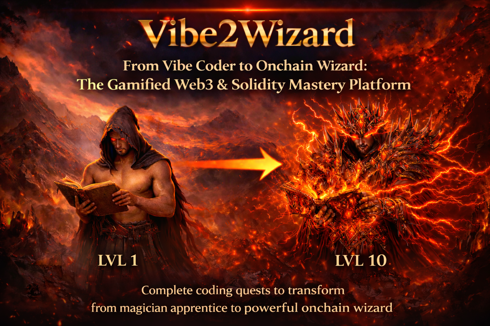

# 🧙‍♂️ Vibe2Wizard Hardhat

This repository contains the smart contracts and deployment scripts for the **WizardPassport** NFT, part of the Vibe2Wizard ecosystem.

## 📜 Smart Contracts

### `WizardPassport.sol`
A specialized **ERC721** NFT contract built using the **OpenZeppelin 5.0** library, serving as the primary identity token for the ecosystem.

- **Standard**: ERC721 with Dynamic On-chain Metadata.
- **Soulbound**: Non-transferable identity token.
- **Level & XP**: Integrated progress tracking system (Levels 1-100).
- **Security**: Progress management is kept internal (`private`) to ensure integrity and prevent arbitrary manipulation by external parties or admins.

### 🚀 Deployment
The contract is live and verified on **Avalanche Fuji (Testnet)**:
- **Address**: [`0x2341452ba859F19fF6D93054cb9759E118DdA50C`](https://testnet.snowtrace.io/address/0x2341452ba859F19fF6D93054cb9759E118DdA50C)
- **Status**: Verified

### `interfaces/IWizardPassport.sol`
The official interface for the Wizard Passport, enabling other contracts to interact with player identities.
- `getUserStats(address user)`: Returns `xp` and `level`.
- `getXPThreshold(uint256 level)`: Returns XP requirement for any level.
- `getLevelImage(uint256 level)`: Returns the IPFS image URL associated with a specific level tier.

### `libs/WizardPassportXPMap.sol`
An efficient library managing the XP threshold data.
- **Algorithm**: Uses **Binary Search** ($O(\log n)$) for gas-efficient level calculation.
- **Public API**: The library can be queried directly for:
    - `getXPThresholds()`: Returns the full 100-level requirement array.
    - `getXPThreshold(level)`: Returns requirements for a specific level.
    - `calculateLevel(xp)`: Derives level from total XP.

### `UserRegistration.sol`
A contract for managing user profile information within the ecosystem.

- **Gatekeeping**: Registration is only allowed for users who own a **Wizard Passport NFT**.
- **Username Immutability**: A username is chosen during the first registration and **cannot be changed** afterwards.
- **Uniqueness**: Usernames are validated for uniqueness across the entire ecosystem.
- **Profile Fields**: Stores comprehensive user data including:
    - Username (Immutable)
    - First & Last Name
    - Email
    - Social Links (Twitter, Instagram, LinkedIn, Telegram)
    - Avatar URL
- **Functionality**:
    - `registerUser(...)`: Allows a passport holder to set their initial profile or update non-username fields.
    - `getUser(address)`: Retrieves the profile for a registered user.
    - `getUserByUsername(string)`: Retrieves a profile using the unique username.
    - `isRegistered(address)`: Checks if a user has an active profile.
    - `getUserCount()`: Returns the total number of registered wizards.

#### 🚀 Deployment
The contract is live and verified on **Avalanche Fuji (Testnet)**:
- **Address**: [`0x7DCDc8FFDA78400f5a32158f2D60122173E2e58A`](https://testnet.snowtrace.io/address/0x7DCDc8FFDA78400f5a32158f2D60122173E2e58A)
- **Status**: Verified

## 🎮 Level & XP System

The Wizard Passport tracks your journey through the Vibe2Wizard ecosystem with a 100-level progression system.

### How it Works
1.  **Minting**: When you mint your passport, your level is initialized to 1.
2.  **Internal Management**: Experience points are managed internally by the contract's logic to maintain a secure and fair progression system.
3.  **Automatic Level Up**: The contract automatically recalculates your level using binary search every time XP is added. If you cross a threshold, a `LevelUp` event is emitted.
4.  **Visual Evolution**: Your level and total XP are recorded in the on-chain metadata attributes. The NFT image evolves dynamically, linking to high-quality IPFS assets that change as you reach new level tiers (e.g., Lvl 20, 40, 60, etc.).

### 🔍 Efficiency: Why Binary Search?

Calculating a Level from 100 possibilities can be expensive. A typical `for` loop (Linear Search) would require up to 99 checks to find level 99, significantly increasing gas costs for users.

**Binary Search ($O(\log n)$)** cuts the search area in half every step:
- **Linear Search**: Up to **99 checks**.
- **Binary Search**: Maximum of **7 checks** for any level between 1 and 100 ($2^7 = 128$).

### 📊 Example Walkthrough (10,000 XP)
1.  **Start**: Range `[1 - 100]`. Mid is `51`. Threshold is ~176M. `10,000 < 176M` → New range `[1 - 50]`.
2.  **Step 2**: Mid is `26`. Threshold is ~2.1M. `10,000 < 2.1M` → New range `[1 - 25]`.
3.  **Step 3**: Mid is `13`. Threshold is ~135k. `10,000 < 135k` → New range `[1 - 12]`.
4.  **Step 4**: Mid is `7`. Threshold is `25,712`. `10,000 < 25,712` → New range `[1 - 6]`.
5.  **Step 5**: Mid is `4`. Threshold is `8,040`. `10,000 >= 8,040` → New range `[4 - 6]`.
6.  **Step 6**: Mid is `5`. Threshold is `12,489`. `10,000 < 12,489` → Range `[4 - 4]`.
7.  **Result**: Loop ends. **User is Level 4.**

### XP Thresholds (Examples)
| Level | Total XP Required |
|-------|-------------------|
| 1     | 0                 |
| 2     | 2,000             |
| 10    | 62,769            |
| 50    | 150,233,722       |
| 100   | 449,406,276,829   |

## 🖼️ NFT Evolution

The Wizard Passport visually evolves as you reach specific level milestones. The contract automatically updates the `image` field in the metadata to point to the corresponding IPFS asset.



### Level Tiers & Artwork

| Level Range | Tier Name | Preview |
| :--- | :--- | :--- |
| **1 - 19** | Novice |  |
| **20 - 29** | Apprentice |  |
| **30 - 39** | Acolyte |  |
| **40 - 49** | Adept |  |
| **50 - 59** | Mage |  |
| **60 - 69** | Sorcerer |  |
| **70 - 79** | High Mage |  |
| **80 - 89** | Archmage |  |
| **90 - 99** | Master Wizard |  |
| **100** | Grandmaster |  |

## 🛠️ Getting Started

### Prerequisites
- Node.js (v18+ recommended)
- npm or yarn

### Installation
Clone the repository and install dependencies:
```bash
npm install
```

### Compilation
Compile the smart contracts:
```bash
npx hardhat compile
```

### Deployment
The project uses **Hardhat Ignition** for deployments.

1. **Local Node (Dev)**:
   ```bash
   npx hardhat node
   # Then in another terminal:
   npx hardhat ignition deploy ./ignition/modules/WizardPassport.js --network localhost
   npx hardhat ignition deploy ./ignition/modules/UserRegistration.js --network localhost
   ```

2. **Testnet (Avalanche Fuji)**:
   Ensure you have a `.env` file with your `PRIVATE_KEY`.
   ```bash
   # Deploy Wizard Passport
   npx hardhat ignition deploy ./ignition/modules/WizardPassport.js --network fuji --verify

   # Deploy User Registration
   npx hardhat ignition deploy ./ignition/modules/UserRegistration.js --network fuji --verify
   ```


## 🧪 Testing
Run the comprehensive test suite (including validation for soulbound transfers and wallet limits):
```bash
npx hardhat test
```

## ⚙️ Configuration
The project is configured for **Avalanche Fuji** testnet and local development.
- **Solidity**: 0.8.20 (EVM: `paris`)
- **Network**: `fuji` (Chain ID: 43113)
- **Environment**: Uses `dotenv` for secrets. See `.env.example`.


---
Built with ❤️ for the Vibe2Wizard community.
